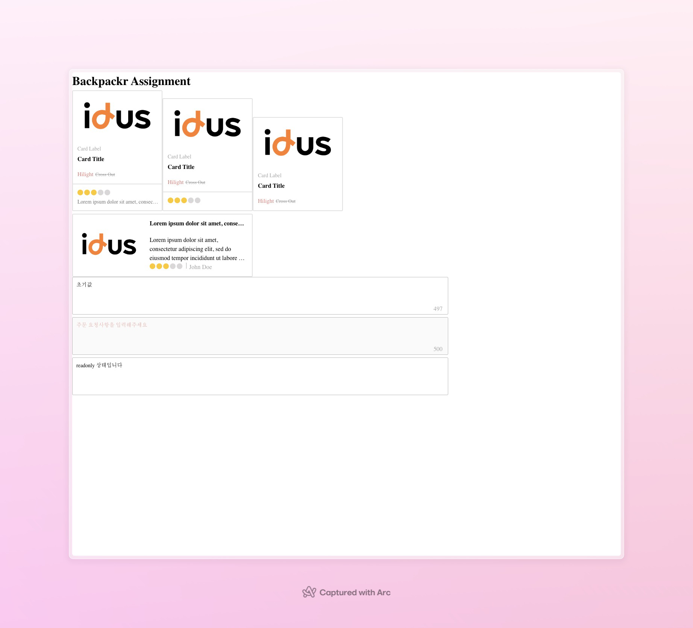

# backpackr_assignment

안녕하세요, 백패커 [텀블벅/스테디오] 프론트엔드 엔지니어 포지션에 지원한 이지혜입니다.

아래는 코딩테스트 UI모듈 제작에 대한 정보입니다.

## 실행방법

1. ui_module.html파일을 더블클릭하여 실행시킵니다.
2. 또는 ui_module.html파일을 마우스 오른쪽 버튼으로 클릭합니다.
3. "연결 프로그램"을 선택하고 사용하는 브라우저를 클릭합니다.

## 디렉토리 구조

- ui_module.html: UI출력을 위한 메인 페이지
- cardBoard.js: Card, verticalCard, 그리고 horizontalCard를 출력하는 함수
- inputForm.js: custom input을 Type (default, disabled, readonly)에 따라 다르게 셋업하는 함수
- css

## 기능 구현

1. 카드 UI

- 기본 Card함수가 공통 요소들을 포함하고 display함수가 html의 `cards` id 아래로 출력합니다.
- 세로형 (VerticalCard)는 title, label, review를 parameter로 받고 별점과 하단 텍스트 영역은 parameter가 있을 경우에만 출력합니다.
- 가로형 (HorizontalCard)는 title, review를 parameter로 받고 카드를 생성합니다.

2. 입력 폼 UI

- Input 함수는 initialValue, type, placeholder, maxlength를 parameter로 받고 form을 최상위 element로 input, button, 그리고 남은 글자 수를 보여주는 span을 감싸고 반환합니다.
- type은 "disabled", "readonly", "default"에 따라 input의 상태를 다르게 반환합니다.
- 입력 중 상태에는 save버튼이 우측에 출력되고 초기값과 같을 경우 사라집니다.
- "readonly"의 스타일은 input을 클릭했을때, outline의 색 변화가 없습니다. 또한 남은 글자수도 출력되지 않습니다.

## Screenshot

